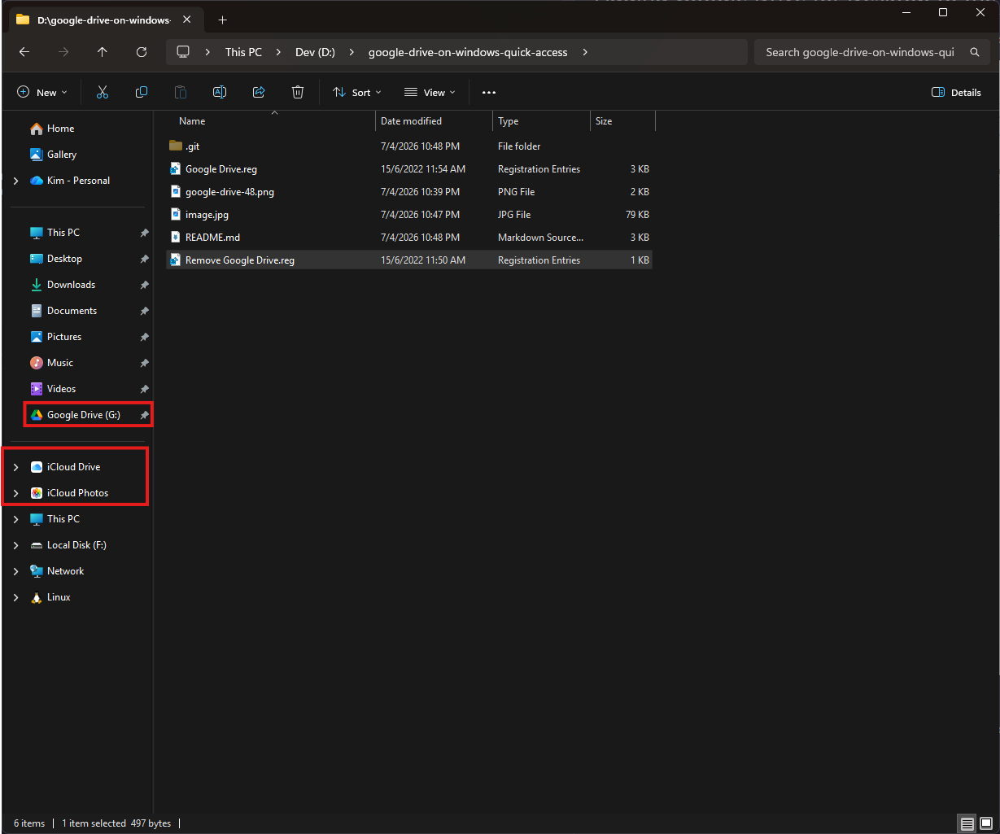
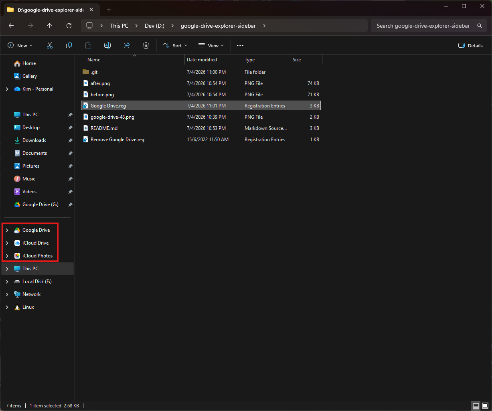

# 📁 Add Google Drive to Windows Explorer Sidebar

By default, apps like OneDrive and Dropbox appear in the Windows Explorer sidebar as pinned shortcuts. However, **Google Drive for Desktop** does not provide this feature out of the box.

This guide shows you how to manually add Google Drive to the Explorer sidebar for quick access.

## ⚠️ Important Notes

* ✅ This works **only with** Google Drive for Desktop
* ❌ **Not compatible with Backup and Sync** (deprecated)
* If you're using Backup and Sync, refer to the original guide: [http://blog.kimmohito.com/google-drive-explorer-sidebar/](http://blog.kimmohito.com/google-drive-explorer-sidebar/)

## 🖼️ Before & After

**Before:**



**After:**



## ⚠️ Disclaimer

* Tested on:
  * Windows 11 Professional
  * Windows 10 Professional
  * Windows 8.1 Professional
* You are modifying the **Windows Registry**
* Always back up your registry before proceeding

## 🚀 Installation Steps

### 1. Download the Repository

Clone or download this repository to your local machine.

### 2. Edit the Registry File

Open `GoogleDrive.reg` using any text editor.

#### Important formatting rule:

* Use `\\\` (triple backslashes), NOT `\\`

### 3. Update Google Drive Executable Path

Find and replace:

```
@="C:\\\Program Files\\\Google\\\Drive File Stream\\\123.0.1.0\\\GoogleDriveFS.exe,0"
```

Replace with your actual installation path.

#### 💡 Recommended (to prevent breaking after updates):

Google Drive updates may delete versioned folders.

Instead:

1. Copy `GoogleDriveFS.exe` to a stable location (e.g. `C:\Backups`)
2. Update path to:

```
@="C:\\\Backups\\\GoogleDriveFS.exe,0"
```

### 4. Update Your Drive Path

Find:

```
"TargetFolderPath"="G:\\\My Drive"
```

👉 Replace with your actual Google Drive folder location.

### 5. Apply the Registry File

* Save your changes
* Double-click `GoogleDrive.reg`
* Click **Yes** when prompted

## ✅ Result

After installation, you should see **Google Drive pinned** in the Windows Explorer sidebar — just like OneDrive or Dropbox.

## 🙌 Credits

* Luke Arentz: [http://luke.digital/adding-google-drive-to-the-explorer-sidebar/](http://luke.digital/adding-google-drive-to-the-explorer-sidebar/)
* Stratium: [https://github.com/Stratium/](https://github.com/Stratium/)

## 💡 Tips

* If the icon disappears after updates → recheck your `.exe` path
* Restart Windows Explorer if changes don’t show immediately

If you want, I can also:

* turn this into a **GitHub-ready markdown (with badges + styling)**
* or make a **one-click `.reg` generator script** so users don’t edit manually 🚀
